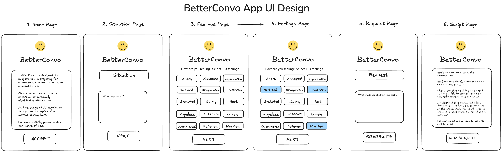

# BetterConvo Project Brief

## Objective
**BetterConvo** is a mobile only web application that helps people prepare for challenging conversations with empathic communication. Users can input a situation, select a feeling, and enter a request. A generative AI model (GPT) will provide a suggested script to help them start their conversation with curiosity, empathy, and courage.

## User Interface

Here is the wireframe for **BetterConvo**:

Here is a link to the wireframe in Excalidraw:
- https://excalidraw.com/#json=SOa_yuv36LySOQHgwOSx8,SkqCRPsZq7MAXu5eldBP7Q

## Features In Scope

### User Inputs
- A situation input field for users to describe their context.  
- A feelings list with predefined emotions.  
- A request input field where users state what they want.  
- A generate button that submits the inputs to the AI.  

### AI-Powered Script Generation
- User inputs are sent to an API request.  
- The response is displayed on the user's screen.  

### Security & Compliance
- User cannot create a personal account.
- No personally identifiable user data is stored.
- A disclaimer appears when the app loads, advising users not to enter private information. 
- User can only use **BetterConvo** if the agree to the terms of use set out in the disclaimer on the **Privacy Disclaimer Screen**. 

### Deployment & Hosting
- **Frontend:** React + TailwindCSS, deployed on Vercel. 
- **Backend:** MongoDB Atlas + Vercel Serverless Functions.

## User Stories & Acceptance Criteria

### User Story 1: User Sees a Disclaimer Upon Opening the App
As a user, I want to see a disclaimer before using the app so that I understand privacy guidelines.  

#### Acceptance Criteria:
- When the app loads, the **Home Screen** displays a disclaimer message.
- When the user clicks the **Next** button, they are taken to the **Privacy Disclaimer Screen**. 
- The disclaimer on the **Privacy Disclaimer Screen** advises users not to enter private information.  
- A **"Terms of Use"** hyperlink is displayed.
- An **"Accept"** button is displayed.
- When the user clicks the **"Accept"** button, the user is taken to the **"Main Screen"**.

### User Story 2: Inputting a Situation
As a user, I want to enter my situation on the **Situation Input Screen** so that I can receive relevant guidance.

#### Acceptance Criteria:
- On the **Situation Input Screen**, the user can enter a text description in the situation input field.  
- When the user clicks the **"Done"** button, they are taken back to the **"Main Screen"**.
- If all inputs are completed, then the user is taken to the **"Generate Screen"**.

### User Story 3: Selecting a Feeling
As a user, I want to choose from a list of feelings on the **Feelings Options Screen** so that I can accurately describe my emotions.

#### Acceptance Criteria:
- When the user clicks the feelings button, a list is displayed.
- The list contains a predefined set of feelings.  
- The user must select at least one feeling before generating the script.
- The user can select up to three feelings from the list.
- Clicking a feeling highlights it to show it has been selected.
- Clicking a highlighted feeling button de-selects and unhighlights the button.
- When the user clicks the **"Done"** button, they are taken back to the **"Main Screen"**.
- If all inputs are completed, then the user is taken to the **"Generate Screen"**.

### User Story 4: Submitting a Request
As a user, I want to specify what I need from my partner on the **Request Input Screen** so that the GPT response reflects my needs.

#### Acceptance Criteria:
- The user can enter text in the request input field.
- When the user clicks the **"Done"** button, they are taken back to the **"Main Screen"**.
- If all inputs are completed, then the user is taken to the **"Generate Screen"**.

### User Story 5: Generating the Script
As a user, I want to generate an NVC-based script so that I can prepare for my conversation.

#### Acceptance Criteria:
- Clicking the **"Generate"** button sends user inputs to the backend.  
- The API processes the inputs and returns a structured response.  
- The script is displayed in a readable format.  
- If there is an API error, the user sees an error message instead of a blank screen.

### User Story 7: Starting a New Request
As a user, I want to clear my inputs and start over so that I can generate a new script for a different situation.  

#### Acceptance Criteria:
- A **"New Request"** button is displayed after the script is generated.  
- Clicking the **"New Request"** button clears all inputs (situation, feeling, and request). 
- The user is taken back to the **"Main Screen"**.  

### User Story 8: Tracking Anonymous Usage Data
As a **BetterConvo** admin I would like to track anonymous visits and the number of prompts made so I can gather insights on app usage without compromising user privacy.  

#### Acceptance Criteria:
- When a user visits the app, an anonymous session record is created or updated in the database.  
- Each session is identified by a random, non-identifiable session ID (not linked to personal data).  
- The database stores the visit count for each session.  
- When a user generates a script, the total number of prompts made in that session is incremented.  
- No personally identifiable information is collected or stored.  

## **Out of Scope**  
- **User Accounts & Authentication** - No logins, profiles, or saved data.  
- **Advanced AI Customisation** - GPT responses are based on a fixed prompt.  
- **Multi-Turn Conversations** - The app provides a single response per request.
- **Responsive Design** - Mobile-only design won't be optimised for desktop screens.

## BetterConvo Project Timeline (4.5 Weeks)

###  Project Start: February 26, 2025

#### 1. Project Proposal (Feb 26, 2025)
- Finalise the project scope, user stories, and deployment plan.  

#### 2. Development Phase (Feb 27 – Mar 15, 2025)
- Deploy BetterConvo on Vercel
- Integrate Vercel Serverless Functions and MongoDB Atlas to handle API requests.
- Build the UI using React and TailwindCSS.  

#### 3. Testing & Debugging (Mar 16 – Mar 22, 2025)
- Use Postman to test API integration and ensure correct responses.  
- Fix UI bugs and improve error handling.  
- Refine the AI-generated response formatting.  

#### 4. Beta Test & Fixes (Mar 23 – Mar 28, 2025)
- Conduct final user testing to catch any remaining issues.  
- Ensure compliance with scope and project requirements.  
- Polish UI and optimise performance.  

#### 5. Final Submission (Mar 31, 2025)
- Submit the completed project for evaluation.  

#### 6. Presentation/Demo Day (TBD)
- Prepare for and present BetterConvo. 

## Privacy Disclaimer Text (Remove later)
- It is your responsibility to ensure that you do not share confidential details.
- By using BetterConvo, you acknowledge that: 
- Your inputs are processed in real time and not stored. 
- AI-generated responses are for guidance only and 
should not replace professional advice.
- You are responsible for how you use the generated content in your personal conversations. 