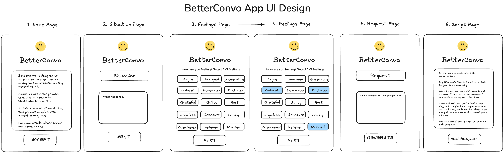

# BetterConvo

Have you ever walked away from a conversation thinking, “I wish I’d said that differently”? 😅😅

I know I have - more times than I can count. Despite good intentions, the right words don’t always come easily in moments that matter. When I started talking to friends, family, and colleagues about this, I realised something:

Most of us struggle to communicate clearly and empathically when we’re under pressure 🤯

And it’s not because we don’t care - it’s because we’re human 🥲❤️ 

So for my graduation project with [Take2](https://www.linkedin.com/company/take2nz/posts/?feedView=all), I wanted to build something to help.


It’s called **BetterConvo**.

**BetterConvo** is a simple, early-stage app that helps people prepare for challenging conversations using empathic communication. Users describe a situation, select a feeling, and make a request. A generative AI model (GPT) provides a suggested script to help the user start their conversation with clarity, empathy, and courage.

👉🏼 Check out the live demo here: [https://betterconvo.vercel.app](https://better-convo-app-git-develop-sean8131s-projects.vercel.app)

## About the Creator - Sean Selby
I created **BetterConvo** ([GitHub: @Sean8131](https://github.com/Sean8131)) as part of my graduation project at [Take2](https://www.linkedin.com/company/take2nz/posts/?feedView=all), a transformative education and tech training programme for people affected by the justice system.

This project was made possible by a **$15,000 Take2 scholarship**, and developed with the incredible support of:

- [Josh Garth](https://www.linkedin.com/in/joshgarth/), Head Teacher at Take2 (thank you for raising the bar and believing in this idea)  

- [Cameron Smith](https://www.linkedin.com/in/cameronpaulsmith1/), CEO of Take2 (thank you for creating the opportunity to study and build this)

I built BetterConvo in public, sharing my progress on LinkedIn and Slack throughout the journey. Much of that approach was inspired by the indie maker philosophy championed by Pieter Levels ([levels.io](https://x.com/levelsio?ref=levels.io)).

## Objective

The goal of BetterConvo is to make it easier for people to initiate courageous conversations by helping them:
- Reflect on what happened
- Acknowledge how they feel
- Clarify what they want/need
- Generate a script that models empathic communication

This app does not replace therapy or professional mediation. It's designed to help people **express themselves more clearly and compassionately** in their everyday relationships.

## User Interface

Here is the wireframe for **BetterConvo**:



Here is a link to the wireframe in Excalidraw:
- https://excalidraw.com/#json=SOa_yuv36LySOQHgwOSx8,SkqCRPsZq7MAXu5eldBP7Q


## Features In Scope

### User Inputs
- A situation input field
- A feelings list with predefined emotions
- A request input field - users state what they want
- A generate button that submits the inputs to the GPT

### AI-Powered Script Generation
- GPT takes the user's input and returns a brief script
- The script uses a first-person, empathic tone aimed at the conversation partner

### Privacy & Compliance
- No accounts or logins  
- No personal data is stored  
- Users must accept a privacy disclaimer before accessing the app


### Deployment & Hosting
- **Frontend**: React + TailwindCSS  
- **Backend**: Express.js server with usage tracking stored in MongoDB Atlas  
- **Hosting**: Vercel (frontend), MongoDB Atlas (data), Express (local or future Render deployment)

## Out of Scope

- User accounts or saved data  
- Multi-turn conversation support  
- Custom GPT prompt tuning via UI  
- Desktop-first design (currently optimised for mobile)

## User Stories & Acceptance Criteria

### User Story 1: User Sees a Disclaimer Upon Opening the App
As a user, I want to see a disclaimer before using the app so that I understand privacy guidelines.  

#### Acceptance Criteria:
- When the app loads, the **Onboarding Sequence** displays a disclaimer message.
- When the user clicks the **Terms of Use** link, they are taken to the **Terms of Use Page**. 
- The disclaimer on the **Terms of Use Page** advises users not to enter private information.  
- A **"Return"** button is displayed on the **Terms of Use Page**.
- When the user clicks the **"Let's begin!"** button, the user is taken to the **"Situation Page"**.

### User Story 2: Inputting a Situation
As a user, I want to enter my situation on the **Situation Page** so that I can receive relevant guidance.

#### Acceptance Criteria:
- On the **Situation Page**, the user can enter a text description in the situation input field.  
- When the user clicks the **"Next"** button, they are taken back to the **"Feelings Page"**.
- If the user enters an input less than 10 charcters long and clicks **"Next"**, they will be alerted to enter a situation with at least 10 characters. 

### User Story 3: Selecting a Feeling
As a user, I want to choose from a list of feelings on the **Feelings Page** so I can accurately describe my emotions.

#### Acceptance Criteria:
- The **Feelings Page** displays a list of predefined feelings.  
- The user must select at least one feeling.
- The user can select up to three feelings from the list.
- Clicking a feeling highlights it to show it has been selected.
- Clicking a highlighted feeling button de-selects and unhighlights the button.
- When the user clicks the **"Next"** button, they are taken to the **Request Page**.
- If the user hasn't selected a feeling and clicks **"Next"**, they will be alerted to select 1-3 feelings.
- If the user selects more than 3 feelings, they will be alerted to select 1-3 feelngs.

### User Story 4: Submitting a Request
As a user, I want to specify what I want on the **Request Page** so that the GPT response reflects my needs.

#### Acceptance Criteria:
- The user can enter text in the request input field.
- When the user clicks the **"Generate"** button, they are taken to the **Script Page**.
- If the user has entered a request less than 10 characters, the user will be alerted to enter a valid request.

### User Story 5: Generating the Script
As a user, I want to generate an empathic script so that I can prepare for my conversation.

#### Acceptance Criteria:
- Clicking the **"Generate"** button sends user inputs to the backend.  
- The API processes the inputs and returns a structured response.  
- The script is displayed in a readable format.  
- If there is an API error, the user sees an error message instead of a blank screen.

### User Story 7: Starting a New Request
As a user, I want to clear my inputs and start over so that I can generate a new script for a different situation.  

#### Acceptance Criteria:
- A **"New Request"** button is displayed after the script is generated.  
- Clicking the **"New Request"** button clears all inputs (situation, feeling, and request). 
- The user is taken back to the **"Situation Page"**.  

### User Story 8: Tracking Anonymous Usage Data
As a **BetterConvo** admin I would like to anonymously track the number of prompts made so I can gather insights on app usage without compromising user privacy.  

#### Acceptance Criteria:
- When a user clicks the **"Generate"** button, an anonymous session record is created in the database.  
- Each session is identified by a random, non-identifiable session ID (not linked to personal data).  
- No personally identifiable information is collected or stored.  

## BetterConvo Project Timeline (7 Weeks)

###  Project Start: February 26, 2025

#### 1. Project Proposal (Feb 26, 2025)
- Finalised the project scope, user stories, and deployment plan.  

#### 2. Development Phase (Feb 27 – Mar 15, 2025)
- Deployed BetterConvo on Vercel
- Built the UI using React and TailwindCSS.  
- Integrated Vercel Serverless Functions to handle API requests.

#### 3. Testing & Debugging (Mar 16 – Mar 22, 2025)
- Fixed UI bugs and improved error handling.  
- Refined the AI-generated response formatting.  
- Used Postman to test API integration and ensure correct responses.  

#### 4. Beta Test & Fixes (Mar 23 – Mar 28, 2025)
- Polished UI and optimised performance.  
- Ensured compliance with scope and project requirements.  
- Integrated MongoDB Atlas to track anonymous usage data
- Conducted final user testing to catch any remaining issues.  
- Conducted final user testing to catch any remaining issues.  

#### 5. Final Submission (April 21, 2025)
- Submitted the completed project for evaluation.  

#### 6. Presentation/Demo Day (April 24, 2025)
- Prepare for and present BetterConvo. 

## Acceptance Criteria Met

The app met all scoped features defined in the initial brief, including:

- Disclaimer flow  
- Script generation via OpenAI  
- Step-by-step user input screens  
- Usage tracking via MongoDB Atlas (anonymous session ID)  
- Fully mobile-responsive design with swipe-style transitions

# BetterConvo – New Machine Setup Checklist

This guide helps you get the BetterConvo app up and running on a new machine quickly and reliably.

## 1. Clone the Repository
```shell
git clone git@github.com:Sean8131/BetterConvo-App.git
cd BetterConvo-App
```

## 2. Install Dependencies
```shell
npm install
```
This will install all frontend dependencies defined in `package.json`, including:
- React
- Vite
- TailwindCSS
- framer-motion
- react-router-dom

## 3. Set Up Environment Variables
Copy the `.env.example` file and fill in:
```shell
cp .env.example .env
```
Then edit `.env` and update any necessary keys (e.g. PORT, OPENAI_API_KEY, MONGO_URI).

## 4. Run the Development Server
```shell
npm run dev
```
Then open your browser to:
```
http://localhost:5173/
```

## 5. Optional Global Tools
You might want to install:
```shell
npm install -g vercel
npm install -g nodemon
```

## 6. Backend Setup (if applicable)
If you're also working on the Express.js backend in `/` and have installed nodemon:
```shell
cd BetterConvo-App
npm install
npm run all
```

## 7. Recommended VSCode Extensions
- Prettier
- Tailwind CSS IntelliSense

## You're All Set!
You should now be able to develop, test, and run BetterConvo locally.

## Future Improvements

- More nuanced emotion + needs vocabulary
- Share/export options for generated scripts  
- Save past conversations with optional login
- Let users choose tone of voice (e.g. soft, assertive, humorous)

## Contact

- GitHub: [Sean8131](https://github.com/Sean8131)  
- Email: sean@seanselby.co.nz
- LinkedIn: [linkedin.com/in/sean-selby](https://linkedin.com/in/sean-selby)  

“Empathy is a respectful understanding of what others are experiencing.” - Marshall Rosenberg